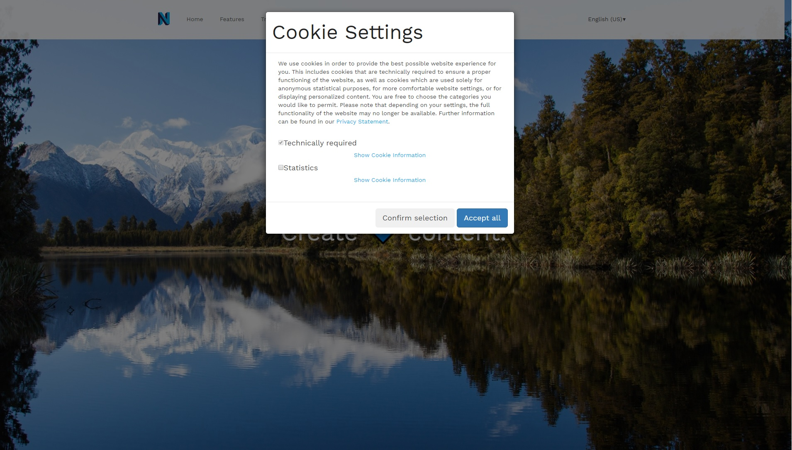

# Cookie Layer
This package gives you full freedom to either use a prepared cookie layer or build your own.

## Implement package cookie layer

This cookie layer has a standard Bootstrap layout.
All functions for the layer are available via a JavaScript file (using jQuery).


<i>[click to enlarge]</i>

<b>HTML:</b>
```html
<script type="text/javascript" src="{f:uri.resource(path: 'resource://Wysiwyg.CookieHandling/Public/Javascript/CookieLayer.js')}"></script>
```

<b>Fusion:</b>  
```neosfusion
src = Neos.Fusion:ResourceUri {
    path = 'resource://Wysiwyg.CookieHandling/Public/Javascript/CookieLayer.js'
}
```
```neosfusion
cookieLayer = Wysiwyg.CookieHandling:Content.CookieLayer {
    cookieLayerDisabled = false
    translationPackage = 'Your.Package.Key'
}
```

The render process of the layer is contingent on your project structure.  

Either in fluid:
```html
{cookieLayer -> f:format.raw()}
```
Or as part of your AFX rendering.

## Settings change by the user 

In order to be GDPR compliant the user has to have the possibility to change their cookie preferences at any time.
You can add a menu item or link anywhere to make this possible:

```html
<a href="javascript:void(0)" id="changeCookies">Cookie settings</a>
```


**For information on how to implement your own cookie layer go to [Customization](./customization.md)**.