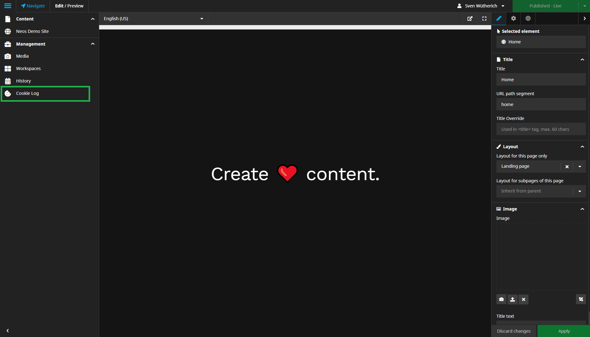
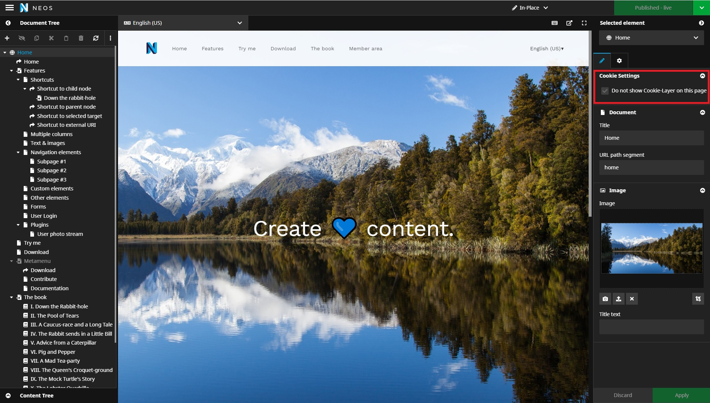

# Usage
This package offers PHP and JavaScript functions to safely deal with all your cookies.

## Set up your cookies
This package uses a Settings.yaml to determine which cookies can be added and how to deal with them.
```yaml
Wysiwyg:
  CookieHandling:
    cleanUp:
      dryrun: false
    showCookieDetails: true
    consentCookieName: 'cookieConsent' # cookie that stores the settings by a user
    cookieGroups:
      technical:                      # key for a specific cookie group 
        label: 'Technical'            # to display group name in the cookie layer
        readOnly: true                # boolean to determine if a group cannot be disabled by the user
        defaultValue: true            # boolean to set the default for the cookie group 
        cookies:                      # list of all cookies 
          cookie_a:                   # key for a specific cookie
            cookieName: 'COOKIE_XYZ'  # used to save the cookie
            lifetime: '2 years'       # lifetime of the cookie
          cookie_b:                   
            cookieName: 'COOKIE_ZXY'
            lifetime: '2 years'
          cookie_consent:
            cookieName: 'cookieConsent'
            lifetime: '3 months'
          cookie_accepted:
            cookieName: 'cookieConsentAccepted'
            lifetime: '3 months'
```
::: tip
Both <code>readOnly</code> and <code>defaultValue</code> are settings for the frontend display in the cookie layer.

The lifetime of a cookie can only be specified in <b>"month(s)"</b> or <b>"year(s)"</b>.

The cookies <code>cookieConsent</code> and <code>cookieConsentAccepted</code> are configured by this package; 'cookieConsent' stores a users cookie preferences as JSON, 'cookieConsentAccepted' stores a hash indicating whether a user has accepted the cookie notice yet / the cookie layer should be shown.
:::

## Code changes PHP

<b>All HTTP components you use, that set cookies need to be updated.  </b>  
You should inject the CookieConsentService
```` php
/**
 * @Flow\Inject
 * @var Wysiwyg\CookieHandling\Domain\Service\CookieConsentService
 */
protected $cookieConsentService;
```` 
This service gives you the opportunity to use the function `tryAddCookie()` that checks if a cookie has been accepted and adds it to the cookie jar.  

This function should replace **ALL** calls to `$response->setCookie()` or `$response->withAddedHeader('Set-Cookie', $cookie) `.  
Instead you will now call `$this->tryAddCookie($yourCookie)`


<b>Before:</b>
```php
$response->setCookie($cookieToAdd); 

OR
 
$response->withAddedHeader('Set-Cookie', $cookie);
```

<b>After:</b>
```php
$this->tryAddCookie($cookieToAdd);
```

## Code changes JavaScript
<b>Before:</b>

```javascript
$.cookie(cookieName, cookieValue, expire);
```
JavaScript offers different ways to add cookies, which means your implementation before might look different than this example.

<b>After:</b>
```javascript
WY.CookieHandling.tryAddCookie(cookieName, cookieValue, expire);
```

## Dealing with unaccepted cookies
Cookies of your domain that have not been accepted by the user through interacting with the cookie layer will be automatically deleted by the `CookieCleanupComponent`. This ensures that old cookies from your domain will not remain after a user changes their cookie preferences.  

All deleted cookies will be logged to give you the opportunity to track non-configured cookies.  

This automatic deletion of cookies can be disabled by flagging the CookieCleanupComponent to use a dry run mode.
To enable this add the following to the configuration:
```yaml
Wysiwyg:
  CookieHandling:
    cleanUp:
      dryrun: true
```

### CookieLog module
You can easily access the cookie log module via the Neos backend.


<i>[click to enlarge]</i>
<br />
<br />
You can see two cookies in this log.  
The first one has a 'Configured' info badge. This is a configured cookie to which a user did not consent.  
The other one has an 'UNKNOWN' warning badge which indicates that there is no configuration for a cookie by this name.
<br />
<br />

<i>[click to enlarge]</i>
<br />  

## Detection of outdated cookie settings
GDPR requires a new consent for cookies whenever the usage of cookies changes (lifetime changes, new cookies, etc.).


This requirement is covered in this package with <code>cookieConsentVersion</code>, an extra cookie that includes a hash of the current cookie settings you have configured.
Whenever the cookie settings change a new hash is generated and if the generated hash is different to the saved version in the cookie,
the cookie layer will pop up again to force the user to give consent to the new cookie usage. 
The new hash is then saved to the cookie.

## Reducing the lifetime of old cookies
Sometimes the need arises to reduce the lifetime of a cookie that users already have saved on their device. In this case 
the package offers the possibility to add a setting to the affected cookie and reduce the lifetime in the following way.

1. Add <code>previousCookieSettingHash</code> with a random number to the cookie's settings like this:
    ```yaml
    cookie_a:                   
      cookieName: 'COOKIE_XYZ'  
      lifetime: '2 years'
      previousCookieSettingHash: '123'
    ```
2. Run the command <code>./flow cookiehash:forcookie COOKIE_XYZ</code> and get the following output:

    ```bash
    +------------+------------------------------------------+
    | CookieName | COOKIE_XYZ                               |
    | Hash       | 9f087fb91e6e8a9e92460b48abee09f7fc4ab1a7 |
    +------------+------------------------------------------+
    ```
   or run <code>./flow cookiehash:cookiehashinformation COOKIE_XYZ</code> to see the current hash and more information
   ```bash
    +------------+------------------------------------------+
    | CookieName | COOKIE_XYZ                               |
    | Hash       | 123                                      |
    | BuildHash  | 9f087fb91e6e8a9e92460b48abee09f7fc4ab1a7 |
    | Outdated?  | YES                                      |
    +------------+------------------------------------------+
   ```
3. Replace the random number in <code>previousCookieSettingHash</code> with the newly generated hash

4. Reduce the lifetime in the settings of the cookie

On the next load of the website the cookie layer will pop up again because the configuration has changed and, 
after saving the cookie settings, the cookies with a lowered lifetime will be updated.


## Pages without cookie layer
According to GDPR some specific pages are not allowed to be blocked by a cookie layer, for example the data privacy page. 
In order to comply with the law this package offers a mixin for your documents to block the layer.
Simply add the mixin `Wysiwyg.CookieHandling:Mixins.CookieSettings` to your document types.


<b>Example:</b>
```yaml
'My.Site:ContentPage':
  superTypes:
    'Wysiwyg.CookieHandling:Mixins.CookieSettings': true
```
In the inspector of these pages you now have the possibility to switch off the cookie layer.



<i>[click to enlarge]</i>
